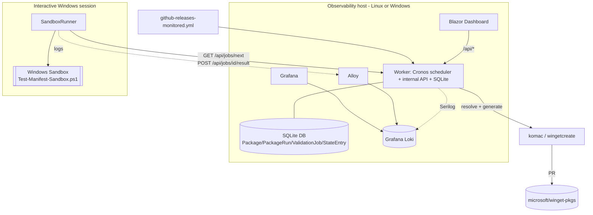

# Architecture & Go-Live Guide (v2 — .NET service)

This document describes the reworked **winget-maintainer** system (the `feat/v2` branch), how the
pieces fit together, and exactly what you need to do to **test it** and **take it live**.

It complements two focused runbooks:

- [docs/sandbox-runner.md](sandbox-runner.md) — running the sandbox validator on Windows.
- [docs/cutover-plan.md](cutover-plan.md) — the shadow → switch → retire → decommission sequence.
- [docker/README.md](../docker/README.md) — the Loki + Grafana + Alloy observability stack.

---

## 1. Why this exists

The legacy pipeline was GitHub Actions cron + generated workflow YAML + PowerShell/Python, with
inter-job communication via artifact-name regex and state committed to `data/package-state.json`.
The rework moves the logic into a maintainable, observable **.NET 8 service** while **keeping the
Windows/winget dependencies** (komac, wingetcreate, Windows Sandbox) that are inherent to the task.

Primary goals: **maintainability** and **visibility** (no more RDP into runners).

---

## 2. Solution layout

One solution, `WingetMaintainer.sln`, with clear layering (lower layers never reference higher ones):

| Project                          | TFM                    | Responsibility                                                                                                                                                                                                                                |
| -------------------------------- | ---------------------- | --------------------------------------------------------------------------------------------------------------------------------------------------------------------------------------------------------------------------------------------- |
| `WingetMaintainer.Core`          | net8.0                 | Domain + logic: config models, URL template engine, release resolvers, manifest hasher, ntfy client, submit/sandbox wrappers, state/queue/runner abstractions, Serilog/Loki bootstrap, API-key validator. **No infrastructure dependencies.** |
| `WingetMaintainer.Data`          | net8.0                 | EF Core (SQLite): `DbContext`, entities, migrations, `EfPackageStateStore`, `ValidationQueue`, `StateJsonImporter`.                                                                                                                           |
| `WingetMaintainer.Cli`           | net8.0                 | `System.CommandLine` app (`winget-maintainer`): `matrix`, `inventory`, `hash`, `submit`, `notify`.                                                                                                                                            |
| `WingetMaintainer.Worker`        | net8.0 (Web SDK)       | Generic host: Cronos scheduler + internal minimal API (queue, runs, state, health) guarded by `X-Api-Key`; owns the SQLite DB.                                                                                                                |
| `WingetMaintainer.SandboxRunner` | net8.0-windows         | Single-consumer client that polls the Worker, runs `Test-Manifest-Sandbox.ps1`, and reports results.                                                                                                                                          |
| `WingetMaintainer.Dashboard`     | net8.0 (Blazor Server) | Overview / package detail / Grafana-embed UI that consumes the Worker API.                                                                                                                                                                    |
| `WingetMaintainer.Core.Tests`    | net8.0                 | xUnit + FluentAssertions (80 tests).                                                                                                                                                                                                          |

Build hygiene: central package versions (`Directory.Packages.props`), nullable + warnings-as-errors
(`Directory.Build.props`), style enforced via `dotnet format` in CI (`.github/workflows/dotnet-ci.yml`).

---

## 3. How it fits together



Key design decisions:

- **Scheduling lives in the Worker** (Cronos), not GitHub Actions.
- **Stages talk through DB rows** (`PackageRun`, `ValidationJob`) — no artifact-name regex.
- **The Worker owns the SQLite DB** and exposes an internal API; SandboxRunner and Dashboard are
  API clients (single-writer). Postgres is the scale-out option if ever needed.
- **Sandbox validation is a single-consumer queue** (`MaxConcurrency = 1`, 30-minute timeout) because
  Windows Sandbox needs an interactive desktop session.
- **Loki labels are low-cardinality only** (`app`, `environment`, `phase`, `host`, `level`); package
  id / version / hashes go in the JSON log body. This is enforced in code by `LokiLabelSchema`.

---

## 4. Configuration reference

All options bind from configuration sections or environment variables (double-underscore syntax).

### Worker (`Worker` section)

| Key                                     | Env var                 | Default                         | Notes                              |
| --------------------------------------- | ----------------------- | ------------------------------- | ---------------------------------- |
| `DatabasePath`                          | `Worker__DatabasePath`  | `winget-maintainer.db`          | SQLite file.                       |
| `ConfigPath`                            | `Worker__ConfigPath`    | `github-releases-monitored.yml` | Monitored packages.                |
| `ApiKey`                                | `Worker__ApiKey`        | _(none → API denied)_           | Required for `/api/*`.             |
| `ScheduleCron`                          | `Worker__ScheduleCron`  | `0 * * * *`                     | Hourly.                            |
| `SubmitEnabled`                         | `Worker__SubmitEnabled` | `false`                         | Legacy `SUBMIT_PR` equivalent.     |
| `MaxFailures`                           | `Worker__MaxFailures`   | `3`                             | Skip threshold (decision D14).     |
| `Environment`                           | `Worker__Environment`   | `Production`                    | Loki label.                        |
| `LokiUri` / `LokiUser` / `LokiPassword` | `Worker__Loki*`         | _(none)_                        | Loki push (console-only if unset). |

### SandboxRunner (`Runner` section) — see [sandbox-runner.md](sandbox-runner.md)

`WorkerBaseUrl`, `ApiKey`, `Host`, `ScriptPath`, `PollIntervalSeconds` (15), `TimeoutMinutes` (30), `Environment`, `Loki*`.

### Dashboard (`Dashboard` section)

`WorkerBaseUrl`, `ApiKey`, `GrafanaBaseUrl`.

> Secrets (API keys, Loki/ntfy credentials, `WINGET_PAT`) go in environment variables or a secret
> store — never committed. `docker/.env` and `*.db` are git-ignored.

---

## 5. What is implemented vs. what still needs work

**Done and tested (unit tests + local smoke):**

- Config parsing, URL template engine, GitHub release resolver (unit-tested with a fake client).
- `matrix` / `inventory` CLI — verified to match the live config count (355).
- SQLite data layer, state store with legacy skip semantics, JSON→DB importer.
- Manifest hasher — **byte-for-byte parity** with the legacy `Get-ManifestHash.ps1` (golden test).
- ntfy client, submit/sandbox command construction, `hash`/`submit`/`notify` CLI.
- Worker host — **live-smoke verified**: DB migrates on boot, scheduler starts, `/health` = 200,
  `/api/*` returns 401 without key and 200 with the key.
- SandboxRunner polling client + timeout mapping; API-key validator.
- Observability stack, 5 Grafana dashboards, and Blazor dashboard authored (build-verified).

**Deferred / needs a live environment, tools, or secrets (not yet exercised):**

- Full manifest **generation** via komac/wingetcreate (`ManifestService`).
- Port of `Test-ManifestContent.ps1` (semantic content validation).
- Wiring the Worker scheduler to the real generate → validate → submit pipeline + submit gating.
- Real PR submission, real Windows Sandbox validation, and sandbox artifact upload.
- App-level Dashboard authentication (currently relies on network isolation / Tailscale).
- Porting the 41 `scripts/Packages/Update-*.ps1` scrapers to C# resolvers (the shim bridges meanwhile).

---

## 6. Testing it (before go-live)

Everything here runs on your dev box; no secrets required.

```powershell
# 1. Build + run the full unit suite (expect 80 passing)
dotnet build WingetMaintainer.sln -c Debug
dotnet test  WingetMaintainer.sln -c Debug

# 2. CLI parity: matrix/inventory counts should match the live config
dotnet run --project src/WingetMaintainer.Cli -- matrix --count
dotnet run --project src/WingetMaintainer.Cli -- inventory --count
(Select-String -Path github-releases-monitored.yml -Pattern '^\s*- id:').Count   # same number

# 3. Manifest hash parity (golden fixtures)
dotnet run --project src/WingetMaintainer.Cli -- hash --path tests/WingetMaintainer.Core.Tests/Fixtures/Manifests/Contoso.App/1.0.0

# 4. Worker smoke test
$env:ASPNETCORE_URLS="http://localhost:5099"; $env:Worker__ApiKey="test-key"
dotnet run --project src/WingetMaintainer.Worker
# In another shell:
Invoke-RestMethod http://localhost:5099/health
(Invoke-WebRequest http://localhost:5099/api/runs -SkipHttpErrorCheck).StatusCode                       # 401
(Invoke-WebRequest http://localhost:5099/api/runs -Headers @{'X-Api-Key'='test-key'}).StatusCode        # 200

# 5. Dashboard smoke test (point it at the Worker)
$env:Dashboard__WorkerBaseUrl="http://localhost:5099/"; $env:Dashboard__ApiKey="test-key"
dotnet run --project src/WingetMaintainer.Dashboard      # browse the printed URL

# 6. Observability stack (needs Docker)
cd docker; cp .env.example .env   # edit secrets
docker compose up -d              # Grafana on :3000, Loki on :3100
```

The **ntfy** and **submit** CLI commands can be tested against a real ntfy topic / a **fork** with a
token when you're ready (`--token`, or `GITHUB_TOKEN` / `WINGET_PAT`).

---

## 7. Going live (recommended order)

Do this incrementally — full detail in [cutover-plan.md](cutover-plan.md).

1. **Provision hosts.** Worker + Dashboard + Loki/Grafana/Alloy on an always-on host (a small Linux VM
   is fine for everything except the SandboxRunner); the SandboxRunner must run on an **interactive
   Windows session** (see [sandbox-runner.md](sandbox-runner.md)).
2. **Secrets & config.** Set `Worker__ApiKey`, Loki/ntfy credentials, and `WINGET_PAT`. Keep
   `Worker__SubmitEnabled=false` for now.
3. **Seed state.** Import `data/package-state.json` into the DB so the skip-threshold semantics start at
   parity.
4. **Stand up observability.** Bring up the Docker stack, confirm Grafana reaches Loki, and that the
   Worker's logs appear. Put Loki/Grafana/Dashboard behind **Tailscale** (or a reverse proxy) — do not
   expose them publicly.
5. **Shadow run (~1 week).** Let the Worker run alongside the existing Actions pipeline **without
   submitting**. Compare resolved version / manifest hash / validation result; investigate divergences.
6. **Switch submission.** Flip `Worker__SubmitEnabled=true` for a small allow-list (with Actions
   submission off for those packages to avoid duplicate PRs), verify PRs land, then widen the list.
7. **Retire the Actions cron.** Disable scheduled workflows (keep manual dispatch if useful); the DB
   becomes the source of truth.
8. **Decommission.** After every package resolves in C# (port the scrapers; the shim bridges the rest),
   remove the PowerShell module, Python orchestrators, and generated workflows from the core loop.

**Rollback** at any step: re-enable the Actions cron and set `SubmitEnabled=false`; the DB and Loki data
remain for diagnosis.

---

## 8. Before you can _fully_ rely on it

These are the remaining engineering tasks (also listed in §5) that must be completed and validated in a
live environment before full cutover:

- [ ] Implement real manifest generation (komac/wingetcreate) and wire the Worker pipeline.
- [ ] Port `Test-ManifestContent.ps1` content validation.
- [ ] Validate a real PR end-to-end through the sandbox in the Test environment.
- [ ] Verify the Loki/Grafana stack, alerts (ntfy), and the Dashboard against live data.
- [ ] Add Dashboard authentication if network isolation isn't sufficient.
- [ ] Port the per-package scrapers to C# resolvers (with golden tests).
